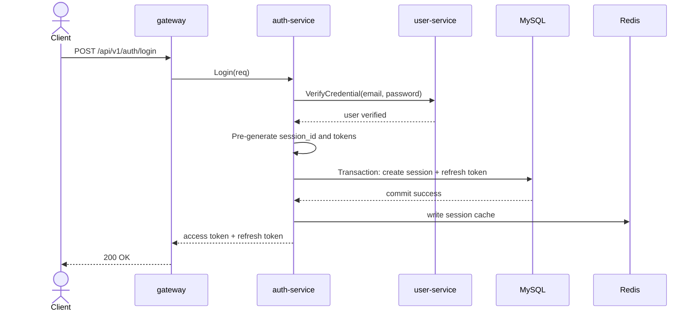
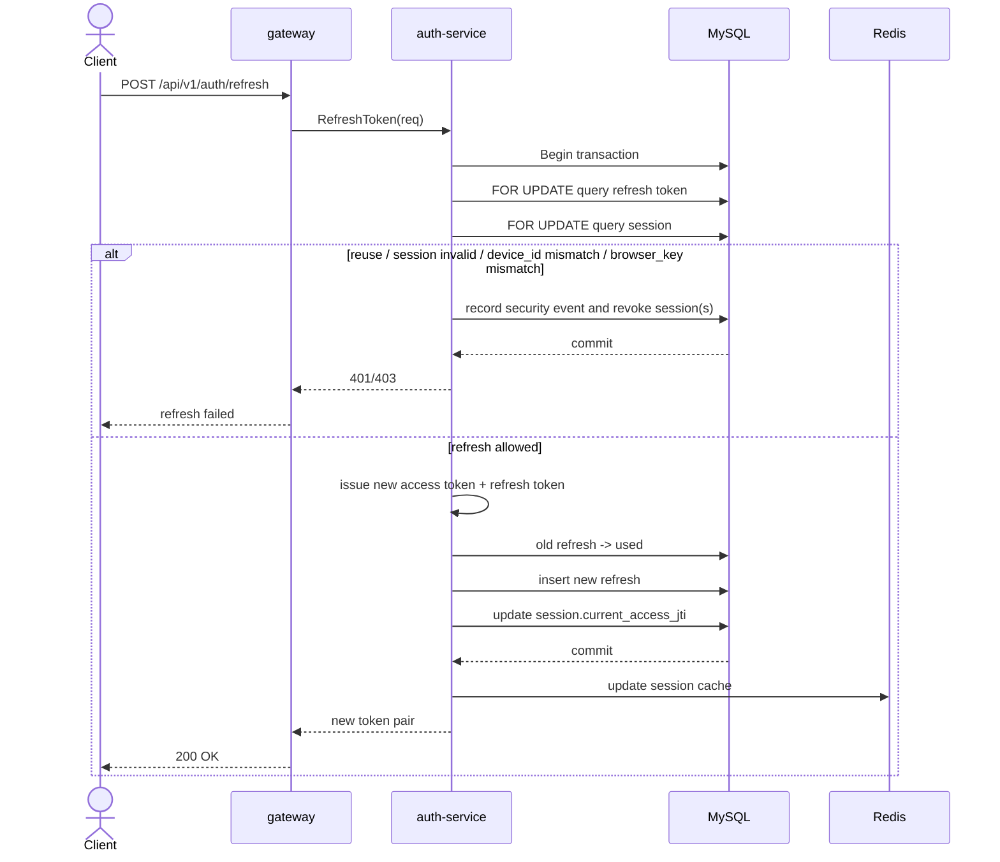

# micro-auth-demo

一个基于 Go、Gin、Kitex、MySQL、Redis 的微服务认证示例项目。

这个项目的目标不是做一个完整生产系统，而是把“网关 + 用户服务 + 认证服务 + 会话管理 + Token 轮换”这条链路拆开，让调用链、分层和状态流转更容易学习和演示。

## 核心功能

- 用户登录，签发 `access token + refresh token`
- 多设备登录与设备会话管理
- `access token` 短期有效，`refresh token` 长期有效
- `refresh token rotation`，旧 refresh 使用后立即失效
- `refresh token reuse detection`，检测到重放后撤销全部会话
- JWT 校验结合服务端 `session` 状态校验
- Redis 维护 session 缓存和 access token 黑名单
- 查看当前账号的登录设备列表
- 登出当前设备
- 登出全部设备
- 踢下指定设备
- 记录安全事件，例如 `ip_changed`、`browser_mismatch`、`refresh_token_reuse`

## 项目结构

- `gateway/`
  Gin HTTP 网关，对外暴露 REST 接口，并通过 Kitex 调用内部服务。
- `auth-service/`
  认证中心，负责登录、刷新、JWT 校验、会话撤销、设备管理和安全事件记录。
- `user-service/`
  用户服务，负责用户查询和密码校验。
- `biz-service/`
  预留的业务服务示例，目前只保留最小占位结构。
- `idl/`
  Thrift 接口定义，Kitex 代码生成的源头。
- `shared/`
  预留的公共工具和公共封装。
- `scripts/`
  代码生成和本地运行脚本。

## 当前技术栈

- Go `1.25.2`
- Gin
- Kitex
- MySQL 8
- Redis 7
- Docker Compose

## 认证设计概览

### 1. 登录

- 用户通过 `gateway` 发起登录请求
- `gateway` 调用 `auth-service.Login`
- `auth-service` 再调用 `user-service.VerifyCredential` 校验账号密码
- 校验成功后创建一条 `session`
- 同时生成：
  - 一个短期有效的 `access token`
  - 一个长期有效的 `refresh token`
- `session` 和 `refresh token` 会落库
- `session` 状态会写入 Redis 缓存



### 2. Access Token

- JWT 中只放认证所需的最小字段
- 当前包含：
  - `user_id`
  - `sid(session_id)`
  - `jti(token_id)`
  - `iat/exp`
- 网关鉴权时不会只信 JWT 本身，还会调用 `auth-service.ValidateToken`
- `auth-service` 会继续校验：
  - JWT 签名是否合法
  - `jti` 是否在黑名单
  - `session` 是否存在且为 `active`
  - 当前 `jti` 是否仍然是该 `session` 的最新有效 access token

### 3. Refresh Token

- `refresh token` 使用高熵随机串
- 服务端只存储 `hash`，不存明文
- 每次刷新成功后：
  - 旧 refresh 立即标记为 `used`
  - 新 refresh 入库
  - 新 access token 签发
- `session.current_access_jti` 更新
- 如果旧 refresh 再次被使用，会触发 `reuse detection`



### 4. Session

- `session` 表示“某个用户在某台设备上的一次登录会话”
- 设备管理的核心对象是 `session`，不是 JWT
- 支持：
  - 查询当前账号所有设备会话
  - 撤销某个设备会话
  - 撤销全部设备会话

## 一致性与安全

- `Login` 采用“预生成 token + 最小数据库事务”
- `Refresh` 使用事务包裹 refresh 状态轮换和 session 更新
- `Refresh` 对旧 refresh 和 session 使用 `FOR UPDATE` 锁，避免并发下重复消费同一个旧 refresh
- `browser_key` 不匹配会记录 `browser_mismatch` 安全事件，并拒绝本次刷新、撤销当前会话
- 浏览器主版本变化仅记录 `browser_version_changed` 事件，不直接拒绝刷新
- `device_id` 不匹配仍然会触发更严格的拒绝和会话撤销

## 快速启动

在项目根目录执行：

```bash
docker compose up --build -d
```

启动后默认服务端口：

- `gateway`: `8080`
- `user-service`: `9001`
- `auth-service`: `9002`
- `biz-service`: `9003`
- `mysql`: `3306`
- `redis`: `6379`

健康检查地址：

- `http://127.0.0.1:8080/healthz`
- `http://127.0.0.1:19001/healthz`
- `http://127.0.0.1:19002/healthz`

## 演示账号

项目启动时会自动写入一个演示用户：

- Email: `demo@example.com`
- Password: `Password123!`

## 常用接口

### 认证

- `POST /api/v1/auth/login`
- `POST /api/v1/auth/refresh`
- `POST /api/v1/auth/logout`
- `POST /api/v1/auth/logout-all`
- `GET /api/v1/auth/sessions`
- `POST /api/v1/auth/sessions/revoke`

### 用户

- `GET /api/v1/users/me`

## 本地开发

生成 Kitex 代码：

```bash
./scripts/gen.sh
```

分别启动服务：

```bash
./scripts/run_user.sh
./scripts/run_auth.sh
./scripts/run_gateway.sh
```

## 适合学习的内容

这个项目比较适合用来练这些主题：

- Gin 网关分层
- Kitex 的 client / server / IDL 调用链
- JWT 与 session 的职责边界
- refresh token rotation
- refresh token reuse detection
- MySQL 事务与 `FOR UPDATE`
- Redis 缓存与黑名单
- 多设备登录与设备管理

## 当前状态

当前仓库已经具备一条可运行的完整认证链路：

- `gateway -> auth-service -> user-service`
- 登录、刷新、鉴权、查询当前用户、设备管理都已打通
- `biz-service` 目前仍是预留服务，后续可以继续扩展业务场景
